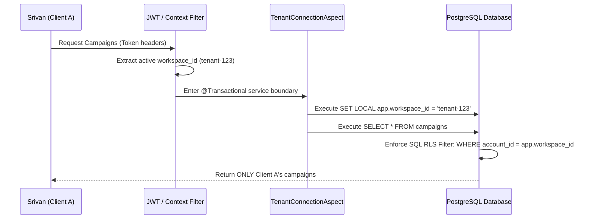

# 🐬 Chubby Dolphin AI — Complete Technical Blueprint & Architectural Manual

This document provides a highly comprehensive, production-grade review of the **Chubby Dolphin AI** marketing suite. It details the complete technology stacks, runtime architecture, low-level mechanics of all core modules, business use cases, and an honest technical evaluation of system trade-offs and limitations (cons).

---

## 🏛️ 1. Technical Stack & Component Layers

Chubby Dolphin AI is split cleanly into a decoupled multi-tier architecture to enforce scalability, multi-tenant safety, and runtime fault tolerance.

### Backend Infrastructure
* **Core Language & JVM**: **Java 21** (utilizes lightweight records, pattern matching, and enhanced collection APIs).
* **Enterprise Framework**: **Spring Boot 3.2.5** (leveraging Spring MVC, Spring Data JPA, Spring Security).
* **Database Migration & Evolution**: **Flyway Migrations** (manages structured versioning from V1 init schemas up to V5 performance metrics).
* **Security & Tokens**: **Spring Security + JWT (JSON Web Tokens)** (implements cryptographic signing of stateless user sessions).
* **Resiliency Decorators**: **Resilience4j** (enforces sliding-window circuit breakers and automatic retry policies).
* **Interceptors & Aspects**: **AspectJ AOP** (runs transaction RLS bounds and dynamic CRUD auditing).

### Frontend UI/UX Suite
* **Framework**: **Angular 18** (fully leveraging **Signals** for frictionless state management and zone-free rendering paths).
* **Styling & Assets**: **Vanilla CSS / SCSS Custom Variables** (no bloated frameworks; utilizes CSS grid systems and sleek modern glassmorphism components).
* **HTTP Client & Pipes**: **RxJS Observables** (manages pipeline requests, auto-refresh triggers, and chat webhook sockets).

### Persistence & Storage
* **Local In-Memory Engine**: **H2 Database 2.2** (boots instantly in the `dev` profile for fast test feedback).
* **Production Database**: **PostgreSQL 16** (engineered with strict structural partitions and native Row-Level Security policies).
* **Caches & Rates**: **Redis Store** (maps transaction limits and temporary JWT validation caches).

---

## 🛡️ 2. Architectural Design Patterns & Core Mechanics

The system's integrity relies on three foundational patterns executed transparently at compile and runtime.

### A. Dynamic Tenant Connection Aspect & Row-Level Security (RLS)
Security in marketing SaaS must strictly prevent Client A from ever reading Client B's leads or budgets. Chubby Dolphin AI handles this at the database layer via **Aspect-Oriented Workspace Isolation**:



* **SET LOCAL app.workspace_id**: Configured to auto-clear when the transaction commits or rolls back, ensuring thread pool isolation under heavy connection recycling.

### B. High-Fidelity LLM Fallback Routing Chain
To protect visual generation and lead qualification from third-party outages, the system implements a cascading router:
1. **Primary**: **Ollama** (local, free, private, zero-latency inference running locally on host hardware).
2. **First Fallback**: **Gemini 1.5 Pro** (commercial high-accuracy API).
3. **Second Fallback**: **HuggingFace Inference API** (cloud models).

```java
public LlmResponse ask(String prompt) {
    if (ollama.isAvailable()) return callOllama(prompt);
    if (gemini.isAvailable()) return callGemini(prompt);
    return callHuggingFace(prompt);
}
```

---

## 🛠️ 3. Core Modules: How They Work & Use Cases

### Module A: Competitor Intel Scraping Agent
* **Use Case**: Analyze a competitor's landing page to immediately extract value propositions, pain points, and hooks.
* **Mechanism**:
  1. The scraper fetches target HTML content, stripping out script payloads to extract raw text content.
  2. The raw context is fed to the `LlmRouterService` decorated by dynamic extraction prompts.
  3. The AI responds with structured JSON arrays representing primary hooks, target demographics, and pricing models, persisting these directly into the `competitor_insights` database partition.

### Module B: Visual Ad Creative Studio
* **Use Case**: Create high-CTR visual Facebook feed ads or Instagram stories on demand.
* **Mechanism**:
  1. Prompts combine competitor insights with user inputs (Target Audience, Tone) and are passed to the copy generation pipeline.
  2. Synthesizes three optimized copy variations containing headlines, bodies, and matching CTAs (Call to Actions).
  3. Seamlessly calls DALL-E 3 image generation endpoints to design visually striking ad graphics, storing the assets on local secure buckets (`image_url`).

### Module C: Conversational live SDR Qualifier Bot
* **Use Case**: Automate conversational sales qualifying over SMS, WhatsApp, or Facebook Messenger webhooks.
* **Mechanism**:
  1. Monitors webhook chats. Upon incoming messages, the message content is analyzed by the lead qualification model.
  2. Evaluates five distinct customer signals: qualification score (0.0 to 1.0), status level (`HOT`, `WARM`, `COLD`), budget expectations, implementation timeline, and target intent.
  3. If qualification score is `HOT` (exceeds `0.7`), the CRM immediately locks status, blocks automated AI intervention, and sounds a live human-takeover notification chip to your dashboard.

### Module D: Self-Correcting Ad Brain Auto-Arbitrage
* **Use Case**: Automatically pause underperforming campaigns and scale up budget for profitable channels.
* **Mechanism**:
  1. A background cron executor triggers the `BrainDecisionService` at configured intervals.
  2. Reads ROAS (Return on Ad Spend) for all active client campaigns across Meta, Google, and TikTok.
  3. Immediately pauses campaigns if ROAS drops below `2.0x`.
  4. Automatically issues a budget increase up to **+30%** if ROAS exceeds `3.0x`, and records the action inside the immutable `AuditLog` database.

---

## ⚠️ 4. Technical Drawbacks & Limitations (Cons)

An honest assessment reveals four key areas of technical trade-offs that developers and operators should manage:

### 1. In-Memory Database Persistence Boundaries (H2 Dev Limit)
* **The Con**: By default, local development executes on an in-memory H2 database. Every time you stop the backend process, **all workspaces, user records, and generated campaigns are completely cleared**.
* **Impact**: Fine for fast verification; highly inconvenient for long-term frontend styling without permanent PostgreSQL wiring.
* **Mitigation**: Switch database profile parameters to persistent containers on local deployments.

### 2. High Latency During Local AI Cold Starts
* **The Con**: The local Ollama route relies on the host computer's processor/GPU performance. If the Mistral/Llama model has swapped out of active RAM, the first prompt request can suffer from a cold start latency of **10 to 15 seconds**.
* **Impact**: The UI might feel unresponsive or lag during conversational lead qualified tests if timeout margins are not fine-tuned.
* **Mitigation**: Keep local models actively pinned in GPU VRAM or immediately fall through to cloud Gemini services.

### 3. API Version Synchronization Overhead
* **The Con**: The platform interacts directly with Meta Graph, Google Ads, and TikTok campaign deployment APIs. These third-party interfaces change schemas and deprecate API versions every 6 to 9 months.
* **Impact**: Launch endpoints might fail if API models, budget types, or authentication token schemes are modified by external networks.
* **Mitigation**: Abstract ad connectors behind unified wrappers (`MetaAdsService`, `GoogleAdsService`) to isolate code modifications when schemas evolve.

### 4. Simple Token Bucket Rate Limiting
* **The Con**: The core SDR rate limiting service (`RateLimiterService`) uses in-memory token buckets to isolate user spamming channels. 
* **Impact**: In a clustered backend server environment (multiple nodes behind a load balancer), local in-memory token buckets are not shared, allowing users to bypass limit thresholds.
* **Mitigation**: Move from local memory buckets to distributed Redis rate-limiting filters.
