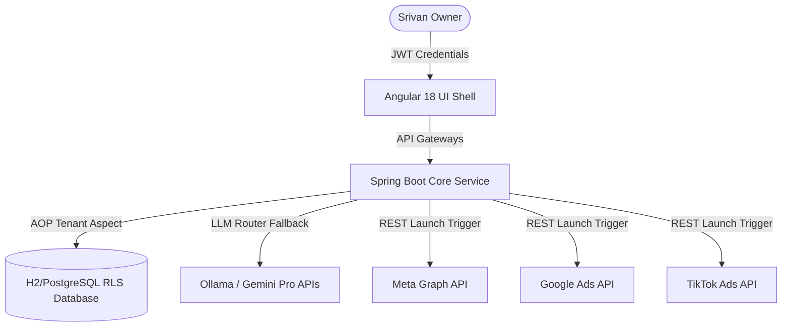

# 🐬 Chubby Dolphin AI — Product Tutorial & User Manual

Welcome to **Chubby Dolphin AI**, the world's first 100% autonomous multi-platform digital marketing suite. This tutorial walkthrough details the core architecture, interactive modules, and detailed usage instructions to get you from absolute zero to live campaign deploys.

---

## 🏛️ System Architecture Overview

Chubby Dolphin AI is engineered around an enterprise-grade micro-core architecture built with **Java 21, Spring Boot 3, and Angular 18 (Signals)**. It enforces security isolation at every level—from multi-tenant database partitions up to JWT token validation—and hooks into LLM routers (Ollama/Gemini) to drive marketing intelligence.



---

## 🖥️ Screen Walkthroughs & Core Components

### 1. ✍️ Creative AI Studio

The **Creative AI Studio** allows you to ingest simple inputs (Product, Audience, Tone, Target Platform) and output comprehensive A/B visual copy templates optimized for maximum click-through rates (CTR).


#### How it works:
1. **Model Generation Prompting**: Prompts are passed to `LlmRouterService` to generate copy in raw JSON templates, adhering strictly to character limit boundaries (e.g. Facebook limits headlines to 40 characters).
2. **Visual Generation Engine**: If you define an visual context, the system runs an integrated generation stream calling DALL-E 3, falling back gracefully to optimized Unsplash high-conversion visual hooks.
3. **Cross-Platform Deploy Controls**: Allows you to instantly trigger launches to **Meta Ads**, **Google Ads**, or **TikTok Ads** with a single click.

#### How to use it:
* Go to the **Creative Studio** tab.
* Click **✨ Generate New Copy** at the top right header.
* Fill in your Product Description (e.g., "Smart Watch X"), Audience (e.g., "Tech Enthusiasts"), Tone (e.g., "urgent"), and Platform (e.g., "FACEBOOK_FEED").
* Click **Generate** and see your variations rendered as gorgeous cards with direct launching action hooks.

---

### 2. 💬 Conversational Lead Nurturing SDR

The **Conversational SDR** qualifiers screen acts as an autonomous sales agent. It watches incoming live lead webhook messages, scoring interest level, qualifying timelines, budgets, and sentiment.


#### How it works:
1. **Automated Qualification**: As leads interact, the SDR bot qualified signals in real-time, mapping properties directly to CRM status updates.
2. **CRM Signal Extraction**: The LLM extracts five parameters from conversational context:
   * **Score**: Qualification value (0.0 to 1.0)
   * **Status**: `HOT` | `WARM` | `COLD` | `UNQUALIFIABLE`
   * **Budget Signal**: Budget boundaries indicated (e.g., "₹50k+ budget available")
   * **Timeline Urgency**: Delivery expectation ("ASAP / Next Week")
   * **Intent Strength**: Intent analysis ("Strong specific product inquiry")
3. **Human Takeover Hook**: If a lead triggers a high qualifier score, a notification is sent to the owner, allowing you to instantly click **Takeover Chat** to complete the deal.

#### How to use it:
* Go to the **Leads** panel in the navigation sidebar.
* Click on any lead to open their active chat conversation history.
* Simulate a chat or connect your actual meta lead page webhooks. Watch the right-hand panel instantly update lead status meters, timeline urgency clocks, and intent qualifications.

---

### 3. 🧠 Ad Brain Auto-Arbitrage Optimizer

The **Ad Brain Optimizer** dashboard enforces strict mathematical performance rules on campaigns to maximize your Return on Ad Spend (ROAS).


#### How it works:
* **Hourly Auto-Evaluation**: Evaluates metrics against pre-configured rules (`application.properties`):
  * Pauses campaigns immediately if `ROAS` falls below `2.0x`.
  * Scales budgets up to **+30%** dynamically if `ROAS` exceeds a healthy `3.0x` score.
* **Auto-Arbitrage**: Compares multi-channel campaigns side-by-side and transfers budget from poor performing groups (e.g., LinkedIn) to high performing groups (e.g., Meta/Google).
* **Activity Logs**: Keeps an absolute, immutable audit trail of every automated execution in the right sidebar.

#### How to use it:
* Navigate to the **Ad Brain** or **Optimization** panel in the sidebar.
* View the ROAS trend graphs mapping overall performance scaling metrics.
* Check the **Ad Brain Activity Logs** to see history logs of exact times when underperforming resources were paused, and budgets shifted.

---

## 🚀 Quick Start Deployment Guide

Now that the database seeding is cleared to an empty slate, follow this recipe to seed your real campaign:

1. **Start the Backend Engine**:
   ```bash
   SPRING_PROFILES_ACTIVE=dev mvn spring-boot:run
   ```
2. **Launch the Frontend UI**:
   ```bash
   npm start
   ```
3. **Log In to Dashboard**:
   * Open `http://localhost:4200`
   * Authenticate using the owner account:
     * **Email**: `admin@chubby.ai`
     * **Password**: `dolphin123`
4. **Deploy Campaign**:
   * Go to **Creative AI Studio** ➔ Generate your visually stunning ad variations ➔ Click **Google Launch** or **TikTok Launch** to trigger active deployments!
